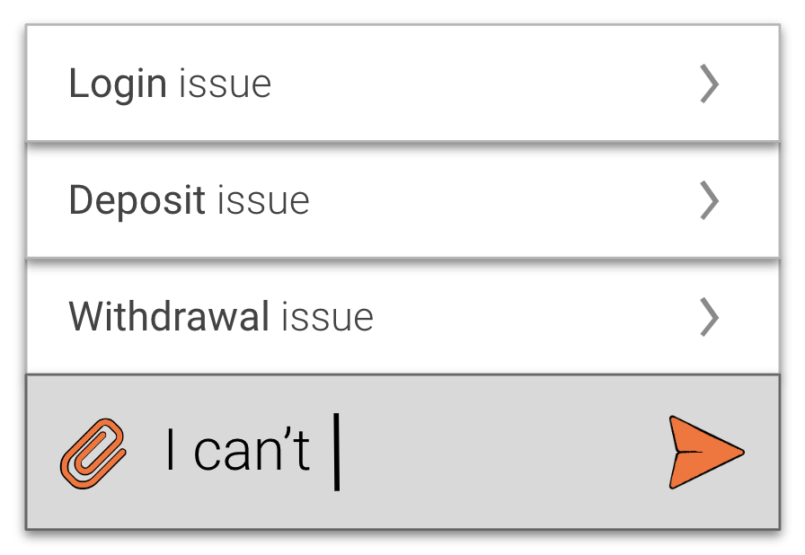

### Intent suggestions

Early user intent detection using n-gram models

<p align="center"></p>

The idea behind intent suggestions is similar to autofill when we use words that were typed to make predictions. But instead of predicting the next word, we try to detect the user's intent.

The proposed approach uses `n` recursively initialised models. Each next model uses a smaller `n`. I.e. a model initialised with `n=3` will include three models (with `n=3`, `n=2` and `n=1`)
This recursive approach allows to also take into account frequency counts from smaller n-grams in case there is no match for the parent model.

### Usage

```
from model import IntentSuggester

model = IntentSuggester()

items = ["one two three four", "five six seven eight"]
labels = ["intent_1", "intent_2"]

model.fit(items, labels)

print(model.predict("zero two three four"))
```
Output:
```
{'intent_1': 0.9902, 'intent_2': 0.0098}
```

### Notation

According to the common notation, an n-gram language model uses `n-1` words to predict the next word.
Given that we are trying to predict a user's intent rather the next word, we'll use a slightly different notation. `n` in our case will represent the number of words used to predict intent probabilities. So a 3-gram (or trigram) model will use three words to make predictions.

### References

The approach was insipred by [this](https://habr.com/ru/post/346578/) work
